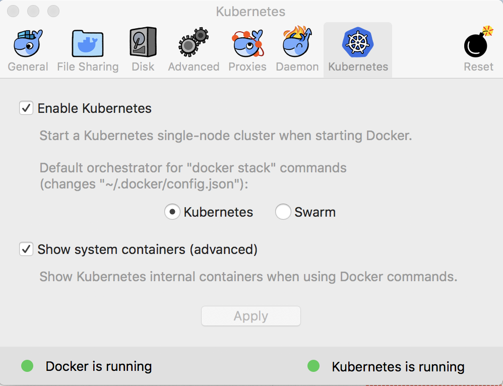
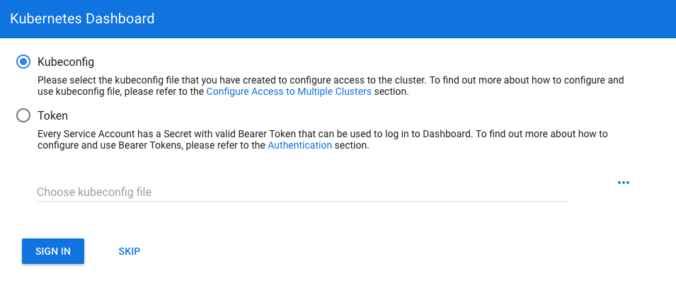

Helm Charts Installer
=====================
[](https://pypi.org/project/helm-charts/)
[](https://pypi.org/project/helm-charts/)
[](https://pypi.org/project/helm-charts/)

Install various Kubernetes Helm charts on a Kubernetes cluster,
This application is mainly intended for local cluster charts installations.     
**Important** helm_charts supports python3.5+ only!

- [Traefik](https://traefik.io/) (As Ingress Controller)
- [Kubernetes Dashboard](https://kubernetes.io/docs/tasks/access-application-cluster/web-ui-dashboard/)
- [OpenFaaS](https://www.openfaas.com/)
- [Airflow](https://airflow.apache.org/)
- More to come

Prerequisites
-------------

Install Docker **Edge** version,
Follow instructions [here](https://store.docker.com/editions/community/docker-ce-desktop-mac) (MacOS), 
Enter Docker preferences, And make sure to activate Kubernetes.


* The application assumes that file `~/.kube/config` created/appended is generated by Docker installation,
  And the config file contains context of `docker-for-desktop`

Installation
------------


Run
```bash
pip3 install helm-charts
```

Usage
-----
**Execute** application   
`helm_charts [-h] [--config-file CONFIG_FILE] [--use-context USE_CONTEXT] [--helm-init]`

Examples
--------

**Specify** config file, default file is: `~/.kube/config`  
`helm_charts --config-file PATH_TO_CONFIG_FILE`

**set** cluster context, default context is: `docker-for-desktop`  
`helm_charts --use-context CONTEXT_NAME`

also **Executes** 'helm init' command  
`helm_charts --helm-init`


Access Kubernetes Dashboard
---------------------------

If `kubernetes_dashboard` selected during installation process,
In order to login, access https://kubernetes.localhost
Press `Choose kubeconfig file` or `...` on right side,  
Select `~/.kube/config.local` file and press `SIGN IN`

